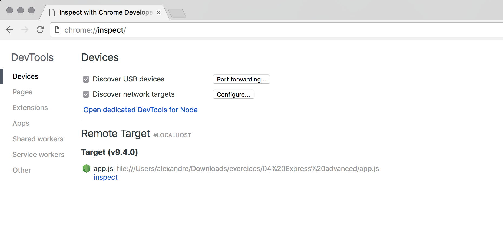
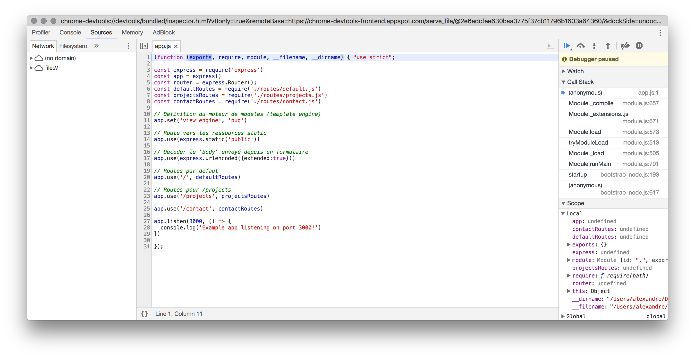

# Récapitulatif du cours du 6 Fevrier 2018

## Comment débugger avec NodeJS

### Si vous utilisez une version de NodeJS < 6.3 (ordinateurs de l'IUT)
Pour les versions antérieures, il est nécessaire d'utiliser le package npm `node-inspector` disponible à l'adresse suivante (https://github.com/node-inspector/node-inspector)[https://github.com/node-inspector/node-inspector]

Pour ce faire, il est nécessaire:

* Installer nodeInspector de façon globale (via `-g`) `npm install -g node-inspector`

Puis

* Ouvrir une nouvelle fenêtre de ligne de commande avec NodeJS et se place dans le répertoire du projet
* Lancer nodeInspector via la commande `node-inspector`

Voilà, nodeInspector est maintenant prêt. Vous pouvez maintenant lancer l'exécution du code en mode debug.
Pour ce faire il vous suffit d'ajouter l'option `--debug-brk` de la façon suivante

```
node --debug-brk index.js
```

puis de lancer la fenêtre de debuggage dans **Google Chrome** (ne fonctionne pas avec Firefox ou Safari), via l'url fournie lors du lancement de nodeInspector.

### Si vous utilisez une version de NodeJS > 6.3
Depuis sa version v6.3, NodeJS intègre un module de débuging. Pour lancer l'exécution du code en mode debug, il vous suffit d'ajouter l'option `--inspect-brk` de la façon suivante

```
node --inspect-brk index.js
```

puis de lancer la fenêtre de debuggage dans **Google Chrome** (ne fonctionne pas avec Firefox ou Safari), via l'url `chrome://inspect`.



Voilà vous pouvez commencer à débugger votre code.


#### Plus d'infos
Voici quelques liens avec des ressources complémentaires

* https://medium.com/@paul_irish/debugging-node-js-nightlies-with-chrome-devtools-7c4a1b95ae27
* Video - Chrome DevTools 101: Debugging JavaScript https://www.youtube.com/watch?v=H0XScE08hy8


## Utilisation d'un moteur de template
Jusqu'à présent nous avons construit notre application web en mélangeant la logique métier écrit en JS avec les vues (= pages) elles-mêmes, écrites en HTML. Cela fonctionne, mais rend difficile la maintenance ainsi que la collaboration. Afin de pallier à ces problèmes, il est une bonne pratique d'utiliser un moteur de template, permettant ainsi de séparer distinctement l’interface graphique du reste de votre application.

### Installation de pug
Pour ce faire nous avons opté pour l'utilisation du moteur `pug` (site officiel)[https://pugjs.org/api/getting-started.html] qui s'installe via npm au même titre que les autres packages via la commande `npm install pug --save`


Il faut maintenant indiquer à expressJS que nous souhaitons utiliser le moteur de template pug.

**app.js**
```js
...
app.set('view engine', 'pug')
...
```
Par défaut express, va maintenant chercher les vues `*.pug` définis dans le dossier `./views/*`.

### Création de notre première vue pug

Il ne reste plus qu'à transformer nos vues `*.html` en vues `*.pug`

*Note: Attention à l'indentation, chaque espace / tabulation manquante ou bien en trop peut générer une erreur ou bien casser l'affichage.*

Par exemple le fichier *index.html*
```html
<html>
  <head>
    <title>Mes projets</title>
    <link rel="stylesheet" href="/style.css">
  </head>
  <body>
    <div class="container">
      <header>
        <h1>Mes Projets</h1>
      </header>
      <nav>
        <ul>
          <li><a href="/">Accueil</a></li>
          <li><a href="/projects">Projets</a></li>
          <li><a href="/contact">Contact</a></li>
        </ul>
      </nav>
      <div class="content">
        #content#
      </div>
      <footer>
        Julien Paroche – 30 Janvier 2018
      </footer>
    </div>
  </body>
</html>

```


devient le fichier **views/index.pug**
```jade
html
  head
    title=myTitle
    link(rel="stylesheet" href="/style.css")
  body
    .container
      header
        h1 Mon site - #{myTitle}
        if username
          span Connecté en tant que #{username}
        else
          span Pas connecté
      nav
        ul
          li
            a(href="/") Accueil
          li
            a(href="/projects") Projets
          li
            a(href="/contact") Contact
          li
            a(href="/login") Login

      .content
          if content != null
            div #{content}
          else
            div Y a pas de contenu

      footer IUT Paris Descartes - Cours programmation back-end avec Julien P. et Alexandre C.
```

Côté JavaScript, il nous suffit de donner
```js
res.render('index', {
  content: accueilText,
  myTitle: 'Accueil',
  sayHelloFunction: sayHello('Alex')
})
```
Ici `index` correspond au nom de ma vue: `views/index.pug`, et l'objet qui suit l'ensemble des variables que l'on veut passer dans la vue.

### Utilisation de variable
La force du moteur de template est de vous laisser passer autant de variables que vous souhaitez et les afficher là où vous le souhaitez.
Il existe plusieurs façons d'afficher la valeur d'une variable

* Nom de la variable uniquement lorsque celle-ci est précédée du nom de la balise HTML suivi de `=`. Par exemple `title=myTitle` ou bien `.content=content` (ici la variable s'appelle content, tout comme le nom que l'on donne à la class associée à la div)
* Entourée de #{maVariable}. C'est certainement la façon la plus répandue, car elle permet d'inclure une variable dans une chaine de caractères. Par exemple: `h1 Mon site - #{myTitle}`
* Sans #{maVariable} lorsque celle-ci est utilisée au sein d'un attribut d'une balise HTML. Exemple: `a(href="/projects/" + project.id) ....` -> `<a href="/projects/1"> ....</a>`

### Aller plus loin grâce à la syntaxe pug
#### Utilisation des IF / ELSE

Extrait de **index.pug**
```jade
.content
  if content != null
    div #{content}
  else
    div Y a pas de contenu
```

#### Utilisation des FOR IN

Extrait de **projects.pug**
```jade
ul
    for project in projectsList
      li
        a(href="/projects/" + project.id) #{project.id} - #{project.name}
```

HTML généré
```
<div class="content">
   <ul>
      <li><a href="/projects/1">1 - super projet</a></li>
      <li><a href="/projects/2">2 - le deuxieme projet</a></li>
      <li><a href="/projects/3">3 - jamais 2 sans 3</a></li>
      <li><a href="/projects/4">4 - difficile de trouver des bons titres</a></li>
      <li><a href="/projects/5">5 - le dernier projet</a></li>
      <li><a href="/projects/10">10 - new project in english</a></li>
   </ul>
</div>
```

#### Autres éléments de syntaxe
Il existe un grand nombre d'autres éléments de syntaxe qui rendent l'écriture des vues simplifiée.
Ces derniers sont décrits ici
* https://naltatis.github.io/jade-syntax-docs/ (CheatSheet)
* https://gist.github.com/joepie91/c0069ab0e0da40cc7b54b8c2203befe1

### Imbrication de plusieurs vues et utilisation d'un layout
Lorsque l'on écrit du code, il est important d’éviter dès que possible toute répétition - c'est le principe de D.R.Y => [Don't Repeat Yourself](https://fr.wikipedia.org/wiki/Ne_vous_r%C3%A9p%C3%A9tez_pas). C'est ce que l'on va faire ici en s'appuyant sur la fonctionnalité "d'héritage" offerte par "pug".

Pour cela il nous faut créer une nouvelle vue `*.pug` qui va content la partie commune à chacune des pages, à savoir le header + footer. Par convention nous l'appelons layout.pug

**layout.pug**
```jade
html
  head
    title=myTitle
    link(rel="stylesheet" href="/style.css")
  body
    .container
      header
        h1 Mon site - #{myTitle}
        if username
          span Connecté en tant que #{username}
        else
          span Pas connecté
      nav
        ul
          li
            a(href="/") Accueil
          li
            a(href="/projects") Projets
          li
            a(href="/contact") Contact
          li
            a(href="/login") Login

      .content
        block dynamicContent

      footer IUT Paris Descartes - Cours programmation back-end avec Julien P. et Alexandre C.
```

On note ici que l'on ajouter dans la partie `.content` la mention `block dynamicContent`. Ceci nous permet de déclarer la partie qui va être injectée en provenance des pages utilisant ce template.

Une fois cela fait, nous pouvons pour chacune de nos vues imbriquées, retirer la partie déclarée dans le fichier layout.pug (qui est celle répétée)


